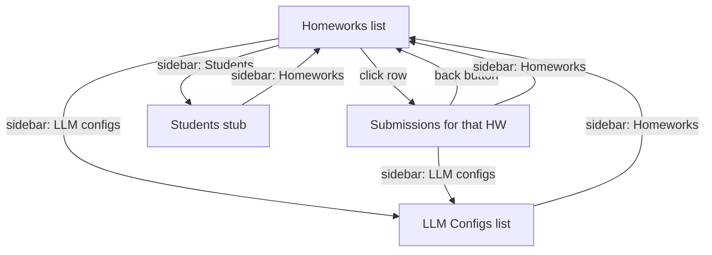

# Admin Console Architecture

The instructor-facing surface of LLTeacher v2. A separate Vite app that ships on port 2312 in dev, shares the design system in `packages/ui` with the student app, and replaces the student's chat-and-paper layout with a cataloged record vocabulary suited to course authoring and submission review.

Lives at `apps/admin/`. Student app architecture is at [generative-ui.md](./generative-ui.md); design system reference is at [../design-system/components.md](../design-system/components.md).

## Aesthetic direction — editorial catalog console

The student web app is a quiet reading room: warm paper, minimal chat, sidebar-as-syllabus. The admin is a **catalog of teaching artifacts**: homework records, LLM config records, submission rows, all anchored by typed catalog IDs (`HW·003`, `CFG·001`).

| Concern | Student app | Admin app |
|---|---|---|
| Layout vocabulary | Chat + paper | Cataloged records + dense tables |
| Sidebar | Homework syllabus progress | Admin sections (Homeworks, Submissions, LLM Configs, Students) |
| Centerpiece | Conversation | Record list with drill-in detail views |
| Breadcrumb | Names current section | Names "Instructor Console · {view}" |
| AI marker color | Heritage Gold | Reused for record IDs + default-config marker |
| Mode signal | None | Heritage Gold dot in the affiliation tag |

Same UW Husky Purple chrome, same Heritage Gold accent, same Geist Sans, same paper background. The brand is one product; the layout vocabulary diverges to match the instructor's task.

### The signature element — RecordId

Every cataloged artifact renders with a small Heritage Gold mono badge: `HW·003`, `CFG·001`. Middle-dot `·` separator, zero-padded 3-digit index, Heritage Gold border + faint Heritage Gold wash. The component is `apps/admin/src/client/components/RecordId.tsx`. The catalog metaphor justifies the dense tabular layout — every row has an ID stamp like a museum specimen.

```tsx
<RecordId prefix="HW" index={3} />     // → HW·003
<RecordId prefix="CFG" index={1} size="sm" />   // → CFG·001 (smaller, for inline use in eyebrows)
```

Prefix is constrained to `"HW" | "CFG" | "STU" | "SEC"` so the catalog vocabulary stays tight. Add a new prefix to the union when a new record type warrants it.

## File layout

```
apps/admin/
├── package.json               name: llteacher-admin, port: 2312
├── vite.config.ts             standard Vite + React + Tailwind 4 config
└── src/client/
    ├── App.tsx                Shell + tagged-union view state + localStorage
    ├── main.tsx               ReactDOM bootstrap
    ├── lib/
    │   └── fixtures.ts        Data shapes mirroring Django models + fixture data
    ├── components/
    │   ├── AdminSidebar.tsx   4-item primary nav, collapsible, quick actions
    │   ├── RecordId.tsx       The signature catalog badge
    │   ├── StatusBadge.tsx    Mono small-caps badge w/ semantic dot
    │   └── PageHeader.tsx     Eyebrow + title + actions strip
    └── views/
        ├── HomeworksView.tsx    Primary landing
        ├── SubmissionsView.tsx  Per-homework student dashboard
        └── LLMConfigsView.tsx   Tutor configuration catalog
```

CSS for every admin-namespaced class lives in `packages/ui/styles.css` under the `ADMIN CONSOLE` block, prefixed `.admin-*`. The decision to keep admin styles in the shared package (rather than admin-local) means a future migration of these components into `packages/ui` is a TypeScript move only — no CSS migration.

## View navigation

No router dep. Type-safe tagged-union view state in `useState<View>`, where `View` is a discriminated union with a `kind` discriminator and per-variant payload:

```ts
type View =
  | { kind: "homeworks" }
  | { kind: "submissions"; homeworkId: string }
  | { kind: "llm-configs" }
  | { kind: "students" };
```

Adding a view = adding a case to `View` + a branch in `App.tsx`'s render. When the view space grows past ~8 routes or shareable deep links become a requirement, swap to React Router — the component shape (a `navigate` callback + an `active` key) is already router-compatible.



The sidebar navigates from anywhere to any top-level section. The submissions view is a drill-in from a homework row and has a back affordance to the homework list. Other drill-ins (homework detail, LLM config detail) follow the same pattern when built.

## Data fixtures — Django model mapping

`apps/admin/src/client/lib/fixtures.ts` defines TypeScript types that are 1:1 with the Django models in `apps/{homeworks,llm,accounts,conversations}/src/models.py`. The fixtures are placeholder data; the *types* are the contract that real Drizzle queries will satisfy in Phase 1.

| TS type | Django model | Fields preserved |
|---|---|---|
| `Teacher` | `accounts.models.Teacher` | id, name, email |
| `Student` | `accounts.models.Student` | id, name, initials (display), email |
| `LLMConfig` | `llm.models.LLMConfig` | id, recordNumber (display), name, modelName, basePromptPreview, temperature, maxCompletionTokens, isDefault, isActive, createdAt |
| `SectionSummary` | `homeworks.models.Section` | id, homeworkId, title, order, hasSolution, submissionsCount (aggregated) |
| `Homework` | `homeworks.models.Homework` | id, recordNumber (display), title, description, dueDate, llmConfigId, sections, status (lifecycle), studentsTotal, studentsActive, submissionsCount, lastActivity |
| `SubmissionRow` | aggregate across `conversations` + `submissions` | studentId, name, initials, sectionsProgress, conversationCount, status, lastActivity |

`recordNumber` is a display-only field — it backs the `HW·xxx` / `CFG·xxx` ID badges. In Phase 1 it will be derived from `created_at` ordering per record type (so `HW·001` is always the oldest homework, `HW·002` the next, etc.).

`status` on Homework collapses several Django concerns into one lifecycle enum: `"draft" | "scheduled" | "active" | "past_due" | "archived"`. Today's logic: scheduled = future due date and no sections submitted; active = currently before due date with sections in flight; past_due = due date passed with at least one student still active; archived = closed-out. Real Drizzle queries will compute this from `dueDate` + section/submission aggregations.

## Sidebar collapse

Mirrors the student web app's pattern verbatim:

- Root `<aside>` toggles `.sidebar` and `.sidebar sidebar--collapsed` based on an `isCollapsed` prop
- Same `.sidebar__top` + `.sidebar__collapse-toggle` markup with the same `CaretDoubleLeft` / `CaretDoubleRight` chevron switch
- Same 200ms width transition (240px → 64px)
- `prefers-reduced-motion` rule from the base sidebar block covers the transition

Two intentional differences from the student sidebar:

1. **Distinct localStorage key.** Admin uses `llteacher:admin-sidebar-collapsed`; student uses `llteacher:sidebar-collapsed`. Different surface, different user, different optimal default — and an instructor toggling collapse in the console shouldn't affect a student's chat layout on the same machine.
2. **Different collapsed content.** Admin hides labels via `.sidebar--collapsed .admin-sidebar__*-text`, `*-label` selectors. Nav items collapse to centered 24px icons; quick-actions become 28×28 icon-only squares with their dashed border preserved. The active item's Heritage Gold leading bar stays visible so the current page reads from the rail edge.

Accessibility: `aria-label` and native `title` give the textual label as a tooltip fallback when the visible text is hidden. `aria-expanded` on the toggle button mirrors the state.

## TopNav admin mode

The shared `<TopNav>` in `packages/ui/src/components/TopNav.tsx` gained one prop:

```tsx
admin?: boolean
```

Default `false`, so the student app's call site is unchanged. When `true`, the affiliation tag swaps from `"· University of Washington"` to a Heritage Gold dot + `"Admin · University of Washington"`. CSS handles the layout — `.top-nav__tag--admin` becomes an inline-flex container with gap, the `.top-nav__admin-dot` is a 6px circle with a soft Heritage Gold glow ring.

```tsx
<TopNav
  course="STATS 311"
  term="Autumn 2026"
  homework="Instructor Console · Homeworks"
  userInitials="AC"
  admin   // ← the only difference from student usage
/>
```

The breadcrumb's `homework` prop is repurposed for admin views to carry the current view's name (`"Instructor Console · Homeworks"`, `"Instructor Console · LLM Configs"`, etc.) — the existing `text-transform: uppercase` on `.top-nav__breadcrumb` handles casing.

!!! note "Why the dot replaces the bullet, not adds to it"
    Earlier draft used "· [gold dot] ADMIN · UNIVERSITY OF WASHINGTON" with both a text bullet and a gold dot. Visually noisy. The current treatment — gold dot *instead of* the bullet — is the at-a-glance signal: gold dot means "instructor mode," absent means "student." One visual change carries the entire mode-switch semantic.

## Adding a new view

Three files, three edits:

### 1. Extend the view discriminated union

`apps/admin/src/client/App.tsx`:

```ts
type View =
  | { kind: "homeworks" }
  | { kind: "submissions"; homeworkId: string }
  | { kind: "llm-configs" }
  | { kind: "students" }
  | { kind: "homework-edit"; id: string | "new" };   // ← new

const NAV_BREADCRUMB: Record<View["kind"], string> = {
  // ...existing,
  "homework-edit": "Instructor Console · Homework editor",   // ← new
};
```

### 2. Build the view component

`apps/admin/src/client/views/HomeworkEditView.tsx`:

```tsx
export type HomeworkEditViewProps = {
  homework: Homework | null;   // null when creating
  onSave: (h: Homework) => void;
  onCancel: () => void;
};

export function HomeworkEditView({ homework, onSave, onCancel }: HomeworkEditViewProps) {
  return (
    <div className="admin-view">
      <PageHeader
        eyebrow={homework
          ? <><RecordId prefix="HW" index={homework.recordNumber} size="sm" /> · EDIT</>
          : "NEW HOMEWORK"}
        title={homework?.title ?? "New homework"}
        actions={<button className="admin-button admin-button--primary" onClick={() => onSave(/* ... */)}>Save</button>}
      />
      {/* form fields */}
    </div>
  );
}
```

### 3. Wire the render branch

`apps/admin/src/client/App.tsx`:

```tsx
{view.kind === "homework-edit" && (() => {
  const hw = view.id === "new" ? null : HOMEWORKS.find((h) => h.id === view.id) ?? null;
  return (
    <HomeworkEditView
      homework={hw}
      onSave={(h) => { /* persist */; setView({ kind: "homeworks" }); }}
      onCancel={() => setView({ kind: "homeworks" })}
    />
  );
})()}
```

If the view needs sidebar selection state, extend `AdminNavKey` and add a `NAV_ITEMS` entry in `AdminSidebar.tsx`. For drill-in views (like `homework-edit` from a homework row), the existing sidebar selection often stays on the parent section, so no nav change is needed.

## Footguns

| Pitfall | What happens | Fix |
|---|---|---|
| New file under `apps/admin/src/client/lib/` | `.gitignore` line 27 (`lib/`, a Python convention) silently drops it from `git status` | Confirm the `!apps/admin/src/client/lib/` negation is still in `.gitignore` (it was added in `c759a81`). New `lib/` subdirs elsewhere need their own negations. |
| Inline `<header>` with classnames like `top-nav__left` | Classes don't exist — the layout breaks | Use `<TopNav>` from `@llteacher/ui` instead of inlining. The shared component is the source of truth. |
| Manually uppercasing the affiliation tag in JSX | `.top-nav__tag` already has `text-transform: uppercase` → double-uppercase or visually inconsistent | Pass sentence-case text; let CSS handle casing. |
| New admin component placed in `packages/ui/src/` | Couples it to the design system contract too early | Keep admin-only components in `apps/admin/src/client/components/` until they're proven reusable. Promote later. |
| Forgetting an `aria-label` on a collapsed nav item | Screen readers see only an icon | Pass `aria-label={isCollapsed ? item.label : undefined}` and the same string to `title` for hover tooltips. Already wired in `AdminSidebar.tsx`. |

## What's not yet built

Scaffolded in the navigation but stubbed:

- **Students view** — shows the "coming next" placeholder. Data shape (`Student` type) is in `fixtures.ts`. Next step: course roster view with per-student aggregate progress.
- **HomeworkEditView** — clicking a homework row currently routes to its Submissions view (faster path to the most-used affordance). A full form view with the section CRUD pattern from the Django `homeworks/form.html` template is the natural next addition.
- **LLMConfigEditView** — drilling into a config row currently logs. The form view from `llm/config_form.html` (with the OpenAI getting-started help section) is the natural next addition.
- **Conversation viewer** — drilling from a submission row into a student's chat transcript would close the loop on grading workflows.

Each of these has fixture data ready and a clear path through `App.tsx`'s view state — they're additions, not refactors.

## References

- `apps/admin/src/client/App.tsx` — shell + view state machine
- `apps/admin/src/client/lib/fixtures.ts` — data shapes (the Drizzle contract)
- `packages/ui/src/components/TopNav.tsx` — shared chrome with `admin` prop
- `packages/ui/styles.css` — admin-namespaced CSS block at the bottom of the file
- Django models for the data shapes: `apps/{homeworks,llm,accounts,conversations}/src/models.py`
- Django instructor templates for copy patterns: `apps/{homeworks,llm}/templates/`
- [generative-ui.md](./generative-ui.md) — student-app chat architecture (separate concern)
- [dev-api-proxy.md](./dev-api-proxy.md) — Vite dev proxy (shared between admin and student when admin grows its own Worker routes)
