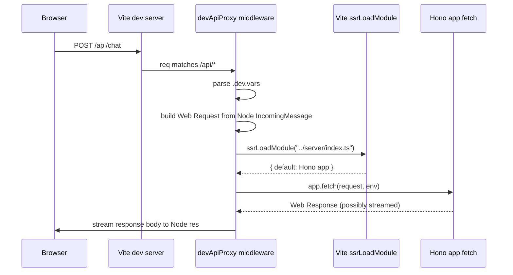

# Dev API Proxy

A Vite middleware plugin that runs the real Hono Worker code inside Vite's Node process for `/api/*` requests during development. Lives in `apps/web/vite.config.ts` as `devApiProxy`.

## Why it exists

`@cloudflare/vite-plugin` is meant to route `/api/*` requests to the Worker in dev, but it wasn't reliably doing so for this project — every `/api/*` request returned 404 from Vite's static-asset middleware before the Cloudflare plugin had a chance to handle it.

The original workaround was a static middleware stub that hardcoded a fake response for `/api/hello`. That worked for one endpoint but didn't scale. When `/api/chat` shipped, it 404'd because the stub had no entry for it.

The proxy is the generic replacement: it forwards every `/api/*` request to the actual Hono app, so the same Worker code runs in dev and prod.

## What it does



Critically, this means:

- The **same Hono code** runs in dev and prod
- HMR + source maps work via Vite SSR
- `.dev.vars` is parsed manually so secrets like `OPENROUTER_API_KEY` are available
- Streaming responses (SSE, AI SDK UI message stream) pass through correctly via a ReadableStream reader loop

## How it works

### `.dev.vars` parsing

`.dev.vars` uses Cloudflare's format (not Vite's `.env`):

```
OPENROUTER_API_KEY=sk-or-...
DATABASE_URL=postgres://...
```

The proxy reads it at request time with `fs.readFileSync` and parses line-by-line — splits on `=`, strips surrounding quotes, ignores blanks and `#` comments. The path is resolved relative to the workspace root (the dir containing `package.json` and `wrangler.jsonc`), not Vite's `root` (`src/client/`).

Rebuild-free: edits to `.dev.vars` take effect on the next request without restarting Vite, because the file is read per-request.

### `ASSETS` binding stub

The Worker's catch-all route `app.all("*", (c) => c.env.ASSETS.fetch(c.req.raw))` would crash without an `ASSETS` binding. The proxy stubs it with a function that returns `404 Not Found (dev API proxy)`. In production, the Cloudflare runtime injects the real ASSETS binding pointing at the built client bundle.

### Node → Web Request adapter

Vite's middlewares receive Node's `IncomingMessage` / `ServerResponse`. Hono expects Web `Request` / `Response`. The conversion:

```ts
const url = `http://${req.headers.host ?? "localhost"}${req.url}`;
const body = method !== "GET" && method !== "HEAD"
  ? (Readable.toWeb(req) as ReadableStream)
  : undefined;

const request = new Request(url, {
  method,
  headers,
  body,
  ...(body ? { duplex: "half" } : {}),
} as RequestInit & { duplex?: string });
```

The `duplex: "half"` option is required by the fetch spec when the request body is a stream. TypeScript's `RequestInit` doesn't include `duplex` yet, so it's cast.

### Module loading

```ts
const mod = await server.ssrLoadModule("../server/index.ts");
const app = mod.default;
```

The relative path `../server/index.ts` resolves from Vite's `root` (`src/client/`), so it points at `src/server/index.ts`. SSR module loading gives the proxy live HMR — edit any file in `src/server/`, the next request picks up the change automatically.

### Streaming response

The Hono response body is a `ReadableStream`. The proxy drains it with a reader loop:

```ts
const reader = response.body.getReader();
while (true) {
  const { value, done } = await reader.read();
  if (done) break;
  res.write(Buffer.from(value));
}
res.end();
```

This preserves SSE / text/event-stream / AI SDK UI message stream protocols. Headers are forwarded before the body so the browser sees the correct `Content-Type` and the EventSource / `useChat` transport works.

### Error handling

Errors are caught at the top-level middleware and surfaced as `500 { error: <message> }` JSON. The full error is also logged with `console.error("[dev-api-proxy] error:", err)` so the Vite terminal shows what went wrong during dev. Without this, a thrown error in the Worker would surface as a generic Vite 500 with no useful information.

## When to remove

This plugin is a workaround. Remove it when `@cloudflare/vite-plugin` reliably handles `/api/*` routing end-to-end in dev. The fact that production deploys don't use this code at all means removing it is a no-op for prod.

A quick check: comment out `devApiProxy` from the `plugins` array and curl `/api/hello`. If Vite returns the real Hono response (not the index.html shell), the proxy is no longer needed.

## Footguns

| Pitfall | What happens | Fix |
|---|---|---|
| Edit `vite.config.ts` while dev is running | The proxy middleware doesn't HMR — config changes don't take effect | Restart `npx turbo dev` |
| Worker throws at module load | Vite SSR caches the failed module; subsequent requests fail with the same error | Restart Vite, fix the error |
| `.dev.vars` missing | `env` has only the `ASSETS` stub; routes requiring `OPENROUTER_API_KEY` return 500 with a "not set" message | Add the key |
| `.dev.vars` in `apps/web/` not workspace root | `loadDevVars(workspaceRoot)` resolves it correctly — workspace root is `apps/web/` | n/a — works as expected |
| Streamed response hangs | The reader loop is awaiting forever | Check Worker logs; likely a downstream stream that never closes |

## See also

- [generative-ui.md](./generative-ui.md) — the chat loop that depends on this proxy in dev
- `apps/web/vite.config.ts` — source
- `apps/web/src/server/index.ts` — the Hono app the proxy invokes
