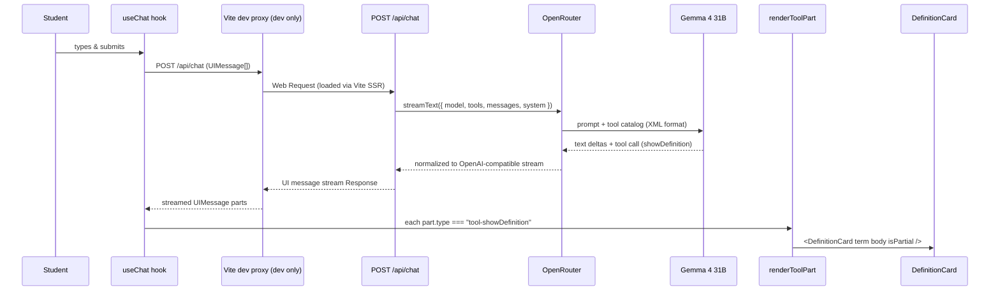

# Generative UI Architecture

LLTeacher v2 renders LLM responses as a mix of streamed markdown text **and** structured React components produced by tool calls. The first display tool is `showDefinition`, which renders a `<DefinitionCard />` inline inside an AI message. The same pattern extends to additional tools (charts, multiple-choice prompts, R-code runners) without changing any wiring outside the tool registry.

This document covers the architecture end-to-end, the contracts between layers, and the recipe for adding a new tool.

## Stack

| Layer | Tech | Location |
|---|---|---|
| Client chat state | `@ai-sdk/react` `useChat` + `DefaultChatTransport` | `apps/web/src/client/App.tsx` |
| Tool render registry | Plain TS switch returning ReactNode | `packages/ui/src/generative/render.tsx` |
| Tool renderers | React components | `packages/ui/src/generative/*.tsx` |
| Server endpoint | Hono on Cloudflare Workers | `apps/web/src/server/routes/chat.ts` |
| LLM streaming | Vercel AI SDK v5 `streamText` | `apps/web/src/server/routes/chat.ts` |
| Provider | OpenRouter via `@ai-sdk/openai-compatible` | `apps/web/src/lib/ai.ts` |
| Model | `google/gemma-4-31b-it:free` (Gemma 4 31B Instruct) | configured per-request |

## Loop



In production, the Vite dev proxy is absent and the Worker handles `/api/chat` directly via the Cloudflare runtime. Every other arrow is identical.

## Server: `/api/chat`

`apps/web/src/server/routes/chat.ts` exports `chatHandler`, mounted at `POST /api/chat` in `apps/web/src/server/index.ts`.

### Request shape

```ts
{ messages: UIMessage[] }
```

The client posts the full message history (AI SDK convention). The server converts to provider-format messages via `convertToModelMessages`.

### Response shape

The handler returns `result.toUIMessageStreamResponse()` — the AI SDK's UI message stream protocol. The client's `useChat` consumes this and emits `UIMessage[]` updates where each message has a `parts: [{ type: "text" | "tool-<name>", ... }]` array.

### Tool catalog

Tools are typed as `ToolSet` and use `jsonSchema<T>()` from the AI SDK rather than Zod:

```ts
const TOOLS: ToolSet = {
  showDefinition: {
    description: "Render a formal definition card for a named statistical concept...",
    inputSchema: jsonSchema<{ term: string; body: string }>({
      type: "object",
      properties: { /* ... */ },
      required: ["term", "body"],
      additionalProperties: false,
    }),
  },
};
```

!!! warning "Why `jsonSchema()` and not Zod"
    Zod's deeply parameterized types collide with `ToolSet` generic inference and trigger `TS2589: Type instantiation is excessively deep and possibly infinite`. The `jsonSchema<T>()` helper provides equivalent type safety with the same runtime validation, without the type-system explosion. Use this pattern for all future tools.

### Display-only tools have no `execute`

`showDefinition` has no server-side `execute` callback — its only purpose is to stream `term` and `body` to the client for rendering. Tools that need server-side work (a DB lookup, an external API call) would add `execute: async ({ args }) => result`.

### System prompt

The prompt frames the assistant as a Socratic UW statistics tutor and gives the model an explicit cue for when to call `showDefinition`:

> "Call it whenever you are formally introducing a named statistical concept ('p-value', 'null hypothesis', 'standard error', 'confidence interval', 'type I error', etc.) — give the student a polished definition card with the term and a 1–2 sentence plain-language body. For everything else (guiding questions, follow-ups, gentle nudges, walking through computations), reply in plain markdown — no tool call."

Tuning this prompt is the primary lever for tool-call frequency.

### Model: Gemma 4 31B IT (free)

Released 2026-04-02. 262K context window. Native function calling via a custom XML format that OpenRouter normalizes to OpenAI-compatible tool calls before the AI SDK sees them. Strong on Socratic-style instruction following per [Google's docs](https://ai.google.dev/gemma/docs/capabilities/text/function-calling-gemma4). Available on the free tier with rate limits — see [the model page](https://openrouter.ai/google/gemma-4-31b-it:free).

The model is hardcoded in `chat.ts` for now. To make it configurable, wire `OPENROUTER_MODEL` through `c.env` and read it per-request.

## Client: useChat + tool render registry

### Hook wiring

```tsx
const { messages: aiMessages, sendMessage, status: chatStatus } = useChat({
  transport: new DefaultChatTransport({ api: "/api/chat" }),
});
```

The AI SDK owns the message array, streaming state, and the transport. `App.tsx` translates `UIMessage[]` into the design system's `MessageData[]` by mapping each message's `parts`:

```tsx
m.parts.map((part, i) => {
  if (part.type === "text") {
    return <p key={`text-${m.id}-${i}`}>{part.text}</p>;
  }
  return renderToolPart(part as ToolPart, `tool-${m.id}-${i}`);
});
```

Text parts become paragraphs. Tool parts go through the registry. Unknown part types return `null` so the conversation degrades gracefully when the server's tool catalog grows ahead of the client.

### Tool render registry

`packages/ui/src/generative/render.tsx` is a plain switch statement returning ReactNodes:

```ts
export function renderToolPart(part: ToolPart, key: string): ReactNode {
  if (part.type === "tool-showDefinition") {
    const input = (part.input ?? {}) as Partial<{ term: string; body: string }>;
    if (!input.term) return null;
    return (
      <DefinitionCard
        key={key}
        term={input.term ?? ""}
        body={input.body ?? ""}
        isPartial={part.state === "input-streaming"}
      />
    );
  }
  return null;
}
```

The `part.state` machine has four values from the AI SDK: `input-streaming`, `input-available`, `output-available`, `output-error`. The registry passes `isPartial = part.state === "input-streaming"` so renderers can show a streaming-in-progress state (the DefinitionCard renders at reduced opacity).

### DefinitionCard

`packages/ui/src/generative/DefinitionCard.tsx`. Three props: `term`, `body`, `isPartial`. Renders with no card chrome — a subtle warm gold wash background, a large display term in Geist Sans 600 at `--font-size-2xl`, and a custom SVG underline in Heritage Gold that draws itself in via `stroke-dashoffset` animation. Respects `prefers-reduced-motion` (underline appears in final state without animating).

The CSS lives in `packages/ui/styles.css` under the `.definition-card` block. See [the components reference](../design-system/components.md#definitioncard) for visual specification and props.

## Adding a new tool

Three files, three edits:

### 1. Define the tool schema (server)

`apps/web/src/server/routes/chat.ts`:

```ts
const TOOLS: ToolSet = {
  showDefinition: { /* existing */ },
  showDistribution: {
    description: "Render a probability distribution plot...",
    inputSchema: jsonSchema<{ kind: "normal" | "binomial"; mean?: number; sd?: number }>({
      type: "object",
      properties: { /* ... */ },
      required: ["kind"],
      additionalProperties: false,
    }),
  },
};
```

Update the system prompt to teach the model when to call it.

### 2. Build the renderer

`packages/ui/src/generative/ShowDistribution.tsx`:

```tsx
export function ShowDistribution({ kind, mean, sd, isPartial }: ShowDistributionProps) {
  /* render the chart */
}
```

Export from `packages/ui/src/generative/index.ts` and `packages/ui/src/index.ts`.

### 3. Register the renderer

`packages/ui/src/generative/render.tsx`:

```ts
if (part.type === "tool-showDistribution") {
  const input = (part.input ?? {}) as Partial<ShowDistributionProps>;
  if (!input.kind) return null;
  return (
    <ShowDistribution
      key={key}
      kind={input.kind}
      mean={input.mean}
      sd={input.sd}
      isPartial={part.state === "input-streaming"}
    />
  );
}
```

That's the entire surface area. No client transport changes, no message-mapping changes, no streaming protocol changes.

## Streaming behavior

The AI SDK's UI message stream protocol incrementally fills in tool inputs as the model emits them. For `showDefinition`, the typical sequence in `part.state` is:

1. `input-streaming` — `input.term` and `input.body` are being filled in chunk by chunk. The registry's `!input.term` guard prevents rendering until the term arrives.
2. `input-available` — full args are present. Card renders at full opacity.
3. `output-available` — display tools (no `execute`) skip this step.

The `isPartial` flag on the card lets the renderer telegraph the streaming state visually — the current DefinitionCard renders at 50% opacity during `input-streaming` and at full opacity after.

## Production vs dev

The architecture is identical in both environments. The only difference is how `/api/*` gets to the Hono Worker:

- **Production**: the Cloudflare runtime serves the Worker directly. `/api/chat` is one of its handlers.
- **Dev**: Vite's middleware intercepts `/api/*` and forwards to the Worker via Vite SSR. See [dev-api-proxy.md](./dev-api-proxy.md).

Both call the same `chatHandler` function. The only Worker-shape concerns (env bindings, ASSETS) are stubbed by the dev proxy.

## References

- [Vercel AI SDK v5 docs](https://sdk.vercel.ai/docs)
- [OpenRouter Gemma 4 31B IT](https://openrouter.ai/google/gemma-4-31b-it:free)
- [Gemma 4 function calling format](https://ai.google.dev/gemma/docs/capabilities/text/function-calling-gemma4)
- [dev-api-proxy.md](./dev-api-proxy.md) — how `/api/*` reaches the Worker in dev
- [design-system/components.md#definitioncard](../design-system/components.md#definitioncard) — visual spec for the card
