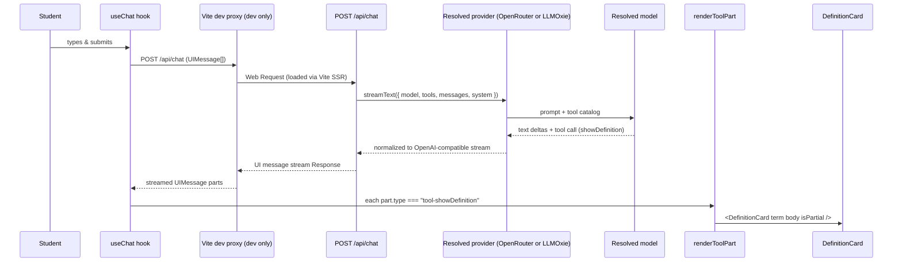

# Generative UI Architecture

LLTeacher v2 renders LLM responses as a mix of streamed markdown text **and** structured React components produced by tool calls. The first display tool is `showDefinition`, which renders a `<DefinitionCard />` inline inside an AI message. The same pattern extends to additional tools (charts, multiple-choice prompts, R-code runners) without changing any wiring outside the tool registry.

This document covers the architecture end-to-end, the contracts between layers, and the recipe for adding a new tool.

## Stack

| Layer | Tech | Location |
|---|---|---|
| Client chat state | `@ai-sdk/react` `useChat` + `DefaultChatTransport` | `apps/web/src/client/App.tsx` |
| Tool render registry | Plain TS switch returning ReactNode | `packages/ui/src/generative/render.tsx` |
| Tool renderers | React components | `packages/ui/src/generative/*.tsx` |
| Server endpoint | Hono on Cloudflare Workers | `apps/web/src/server/routes/chat.ts` |
| LLM streaming | Vercel AI SDK v5 `streamText` | `apps/web/src/server/routes/chat.ts` |
| Provider | OpenRouter or LLMOxie (UW SSEC's own LiteLLM gateway), both via `@ai-sdk/openai`'s `createOpenAI` pointed at each host's OpenAI-compatible surface | `apps/web/src/lib/ai.ts` |
| Model | Resolved per-conversation (#26) from the org/course/homework's `llm_configs` row, never hardcoded — every org's default is `llmoxie`/`gpt-5.3-codex` as of migration 0035 | `apps/web/src/lib/llm-config.ts` |

## Loop

*(#317 review, #353: this doc previously named OpenRouter/Gemma 4 as fixed
participants -- both are resolved per-conversation now, see the Stack
table above. "Provider"/"Model" below stand in for whichever config a
given turn actually resolves to.)*


```mermaid
sequenceDiagram
    participant Student
    participant useChat as useChat hook
    participant Proxy as Vite dev proxy (dev only)
    participant Chat as POST /api/chat
    participant Provider as Resolved provider (OpenRouter or LLMOxie)
    participant Model as Resolved model
    participant Render as renderToolPart
    participant Card as DefinitionCard

    Student->>useChat: types & submits
    useChat->>Proxy: POST /api/chat (UIMessage[])
    Proxy->>Chat: Web Request (loaded via Vite SSR)
    Chat->>Provider: streamText({ model, tools, messages, system })
    Provider->>Model: prompt + tool catalog
    Model-->>Provider: text deltas + tool call (showDefinition)
    Provider-->>Chat: normalized to OpenAI-compatible stream
    Chat-->>Proxy: UI message stream Response
    Proxy-->>useChat: streamed UIMessage parts
    useChat->>Render: each part.type === "tool-showDefinition"
    Render->>Card: <DefinitionCard term body isPartial />
```

In production, the Vite dev proxy is absent and the Worker handles `/api/chat` directly via the Cloudflare runtime. Every other arrow is identical.

## Server: `/api/chat`

`apps/web/src/server/routes/chat.ts` exports `chatHandler`, mounted at `POST /api/chat` in `apps/web/src/server/index.ts`.

### Request shape

```ts
{ messages: UIMessage[] }
```

The client posts the full message history (AI SDK convention). The server converts to provider-format messages via `convertToModelMessages`.

### Response shape

The handler returns `result.toUIMessageStreamResponse()` — the AI SDK's UI message stream protocol. The client's `useChat` consumes this and emits `UIMessage[]` updates where each message has a `parts: [{ type: "text" | "tool-<name>", ... }]` array.

### Tool catalog

Tools are typed as `ToolSet` and use `jsonSchema<T>()` from the AI SDK rather than Zod:

```ts
const TOOLS: ToolSet = {
  showDefinition: {
    description: "Render a formal definition card for a named statistical concept...",
    inputSchema: jsonSchema<{ term: string; body: string }>({
      type: "object",
      properties: { /* ... */ },
      required: ["term", "body"],
      additionalProperties: false,
    }),
  },
};
```

!!! warning "Why `jsonSchema()` and not Zod"
    Zod's deeply parameterized types collide with `ToolSet` generic inference and trigger `TS2589: Type instantiation is excessively deep and possibly infinite`. The `jsonSchema<T>()` helper provides equivalent type safety with the same runtime validation, without the type-system explosion. Use this pattern for all future tools.

### Display tools return a sentinel from `execute`

Display tools (`showDefinition` and the subject figures) still have a server-side `execute`. It returns a sentinel such as `{ status: "displayed" }`. Without a tool result, the history becomes invalid on the student's next message: the model sees an unanswered tool call. The sentinel also lets the model continue with follow-up text in the same turn (`stopWhen`).

### System prompt

The prompt frames the assistant as a Socratic UW statistics tutor and gives the model an explicit cue for when to call `showDefinition`:

> "Call it whenever you are formally introducing a named statistical concept ('p-value', 'null hypothesis', 'standard error', 'confidence interval', 'type I error', etc.) — give the student a polished definition card with the term and a 1–2 sentence plain-language body. For everything else (guiding questions, follow-ups, gentle nudges, walking through computations), reply in plain markdown — no tool call."

Tuning this prompt is the primary lever for tool-call frequency.

### Model: resolved per-conversation, not hardcoded (#26)

*(#317 review, #353: this section originally documented a single
hardcoded model, `google/gemma-4-31b-it:free`, and suggested wiring an
`OPENROUTER_MODEL` env var to make it configurable — #26 shipped a more
general fix instead, described below, before this doc was ever updated
to match.)*

`resolveLLMConfig` (`apps/web/src/lib/llm-config.ts`) picks the model,
provider, and generation params from the first matching row in a
homework → course → org override chain, never from a hardcoded constant.
Every organization's own default is `llmoxie`/`gpt-5.3-codex`
(migration 0035, `scripts/seed.ts`) — LLMOxie is UW SSEC's own LiteLLM
gateway, routed through the same OpenAI-compatible request shape
OpenRouter uses (`buildProviderClient`, same file). An instructor can
already override a specific homework's model without a code change or
redeploy (`llmConfigId` on `PUT /api/courses/:courseId/homeworks/:id`,
`routes/homeworks.ts`); a course-level or org-admin-facing override UI
is not built yet (`courses.llmConfigId` has no write path of its own —
see #351).

## Client: useChat + tool render registry

### Hook wiring

```tsx
const { messages: aiMessages, sendMessage, status: chatStatus } = useChat({
  transport: new DefaultChatTransport({ api: "/api/chat" }),
});
```

The AI SDK owns the message array, streaming state, and the transport. `App.tsx` translates `UIMessage[]` into the design system's `MessageData[]` by mapping each message's `parts`:

```tsx
m.parts.map((part, i) => {
  if (part.type === "text") {
    return <p key={`text-${m.id}-${i}`}>{part.text}</p>;
  }
  return renderToolPart(part as ToolPart, `tool-${m.id}-${i}`);
});
```

Text parts become paragraphs. Tool parts go through the registry. Unknown part types return `null` so the conversation degrades gracefully when the server's tool catalog grows ahead of the client.

### Tool render registry

`packages/ui/src/generative/render.tsx` is a plain switch statement returning ReactNodes:

```ts
export function renderToolPart(part: ToolPart, key: string): ReactNode {
  if (part.type === "tool-showDefinition") {
    const input = (part.input ?? {}) as Partial<{ term: string; body: string }>;
    if (!input.term) return null;
    return (
      <DefinitionCard
        key={key}
        term={input.term ?? ""}
        body={input.body ?? ""}
        isPartial={part.state === "input-streaming"}
      />
    );
  }
  return null;
}
```

The `part.state` machine has four values from the AI SDK: `input-streaming`, `input-available`, `output-available`, `output-error`. The registry passes `isPartial = part.state === "input-streaming"` so renderers can show a streaming-in-progress state (the DefinitionCard renders at reduced opacity).

### DefinitionCard

`packages/ui/src/generative/DefinitionCard.tsx`. Three props: `term`, `body`, `isPartial`. Renders with no card chrome — a subtle warm gold wash background, a large display term in Geist Sans 600 at `--font-size-2xl`, and a custom SVG underline in Heritage Gold that draws itself in via `stroke-dashoffset` animation. Respects `prefers-reduced-motion` (underline appears in final state without animating).

The CSS lives in `packages/ui/styles.css` under the `.definition-card` block. See [the components reference](../design-system/components.md#definitioncard) for visual specification and props.

## Adding a new tool

Three files, three edits:

### 1. Define the tool schema (server)

`apps/web/src/server/routes/chat.ts`:

```ts
const TOOLS: ToolSet = {
  showDefinition: { /* existing */ },
  showDistribution: {
    description: "Render a probability distribution plot...",
    inputSchema: jsonSchema<{ kind: "normal" | "binomial"; mean?: number; sd?: number }>({
      type: "object",
      properties: { /* ... */ },
      required: ["kind"],
      additionalProperties: false,
    }),
  },
};
```

Update the system prompt to teach the model when to call it.

### 2. Build the renderer

`packages/ui/src/generative/ShowDistribution.tsx`:

```tsx
export function ShowDistribution({ kind, mean, sd, isPartial }: ShowDistributionProps) {
  /* render the chart */
}
```

Export from `packages/ui/src/generative/index.ts` and `packages/ui/src/index.ts`.

### 3. Register the renderer

`packages/ui/src/generative/render.tsx`:

```ts
if (part.type === "tool-showDistribution") {
  const input = (part.input ?? {}) as Partial<ShowDistributionProps>;
  if (!input.kind) return null;
  return (
    <ShowDistribution
      key={key}
      kind={input.kind}
      mean={input.mean}
      sd={input.sd}
      isPartial={part.state === "input-streaming"}
    />
  );
}
```

That's the entire surface area. No client transport changes, no message-mapping changes, no streaming protocol changes.

## Subject figures and instructor-chosen packs

Two kinds of tool are always available. Every other figure tool belongs to a subject pack, and a pack is opt-in per LLM config.

**Always available (subject-neutral):**
- `showDefinition`;
- `showWorkedSteps`;
- `knowledgeCheck` (an interactive multiple-choice question, #36);
- `executeRCode`.

**Subject packs** (`packages/ui/src/generative/toolkits.ts`; components in [components.md](../design-system/components.md#subject-figures-figureplate-family)):

| Pack id | Label | Tools |
|---|---|---|
| `economics` | Economics (intro macro) | `showMacroModel`, `showGdpComposition`, `showMultiplier`, `showLaborForce`, `showInflation` |
| `clinical-informatics` | Clinical informatics | `showDiagnosticAccuracy`, `showPrevalenceEffect`, `showRocCurve`, `showPatientTimeline`, `showCdsRule` |
| `statistics` | Statistics | `showDistribution` (#35) |

### How packs are chosen and enforced

- **Choosing.** An instructor ticks packs under **Subject figures** on the LLM config form, in the admin console. The choice is stored in `llm_configs.genui_toolkits` (`text[]`, default `{}`, migration 0056). Packs are therefore optional, and nothing is enabled until someone opts in. Because the choice lives on the config, a homework or course that pins a config gets that config's packs, through the same homework → course → org resolution as the model and the knowledge-access switch.
- **Enforcing.** `toolsForConversation` (`routes/chat.ts`) withholds every pack tool whose pack the resolved config hasn't enabled. A withheld tool is not in the turn's `tools`, so the model can't call it. It's also not in the generated tool paragraph, so the model isn't told it exists. Students can therefore only be shown figures from the packs their instructor chose.
- **Already-saved figures still render.** Turning a pack off later doesn't hide figures already in a transcript. A turn's history is what happened, and the renderer still draws it.
- **Validation.** The route validates the list: an unknown pack id is a 400 that names it. The list is stored normalized (known ids, de-duplicated, in catalog order). An update that omits the field keeps the stored packs, so an older client can't silently wipe them.

### Contract every figure follows

- **Computed, not trusted.** The model supplies arguments only. The figure computes everything it states, in `packages/ui/src/generative/lib/` (`econ.ts`, `clinical.ts`, `stats.ts`, all unit-tested): equilibrium movement, GDP, the rates, PPV/NPV, AUC, rule firing, tail probabilities. Tool descriptions therefore tell the model to name what to draw, not the result.
- **One table.** `render.tsx`'s `FIGURE_TOOLS` maps each part type to a kicker, a deny-by-default parser (`toolInputs*.ts`) and a renderer. Input that hasn't validated yet shows a skeleton while streaming, and nothing once streaming has finished.
- **Per-part error boundary and lockstep (#38).**
  - `renderToolPart` wraps every tool part in `ToolPartErrorBoundary`, so a renderer that throws costs one figure, not the transcript.
  - `figures.test.tsx` and `toolkits.test.ts` check, in `packages/ui`, that every pack tool is renderable and has a renderer.
  - `routes/toolCatalog.test.ts` checks, in `apps/web`, that every server tool is either renderable or deliberately server-only (`requestHint`, `searchKnowledge`, `showKnowledge`), and that every pack tool exists on the server.

### The knowledge check's response path (#36)

`knowledgeCheck` is the first interactive tool. The spec changed from the original issue: messages are AI SDK `parts` with no separate content type, and there is no answer key anywhere.

1. **The model poses the question.** It calls `knowledgeCheck` with `{ question, options }`. The schema has **no answer field** (tested), so nothing in the browser can reveal the answer. The model already knows it and judges the student's choice on its next turn.
2. **The student answers.** `KnowledgeCheck` is a native radio group with one Submit button. The answer is sent as an ordinary user turn: a text part (`My answer to the check "…": B. …`) plus a `data-knowledge-check-response` part with `{ toolCallId, selectedIndex }`. The chat surface's `sendKnowledgeCheckAnswer` does this (`useConversationSurface.tsx`).
3. **The server validates the answer.** `routes/knowledgeCheckAnswer.ts` finds the referenced `tool-knowledgeCheck` call in the conversation's own recent history. It refuses a call that doesn't exist, an out-of-range index, a second answer, or two answers in one message. It then **rebuilds both parts from the stored check**, so the question, the options and the chosen option's text come from the server's record, not the client.
4. **The answer is stored and used.** The message is stored with the data part, which is the durable record for M8's per-section analytics. The model reads the text part; the AI SDK drops data parts from model input. On replay, `collectKnowledgeCheckAnswers` locks the check on the stored answer. On surfaces with no send path, such as transcripts, checks render read-only.

## Streaming behavior

The AI SDK's UI message stream protocol incrementally fills in tool inputs as the model emits them. For `showDefinition`, the typical sequence in `part.state` is:

1. `input-streaming` — `input.term` and `input.body` are being filled in chunk by chunk. The registry's `!input.term` guard prevents rendering until the term arrives.
2. `input-available` — full args are present. Card renders at full opacity.
3. `output-available` — display tools (no `execute`) skip this step.

The `isPartial` flag on the card lets the renderer telegraph the streaming state visually — the current DefinitionCard renders at 50% opacity during `input-streaming` and at full opacity after.

## Production vs dev

The architecture is identical in both environments. The only difference is how `/api/*` gets to the Hono Worker:

- **Production**: the Cloudflare runtime serves the Worker directly. `/api/chat` is one of its handlers.
- **Dev**: Vite's middleware intercepts `/api/*` and forwards to the Worker via Vite SSR. See [dev-api-proxy.md](./dev-api-proxy.md).

Both call the same `chatHandler` function. The only Worker-shape concerns (env bindings, ASSETS) are stubbed by the dev proxy.

## References

- [Vercel AI SDK v5 docs](https://sdk.vercel.ai/docs)
- [OpenRouter](https://openrouter.ai/) — one of the two providers `buildProviderClient` (`apps/web/src/lib/ai.ts`) supports; the other is UW SSEC's own LLMOxie/LiteLLM gateway (internal, not publicly documented)
- [dev-api-proxy.md](./dev-api-proxy.md) — how `/api/*` reaches the Worker in dev
- [design-system/components.md#definitioncard](../design-system/components.md#definitioncard) — visual spec for the card
